# Manual de Utilização — Precifiq

**Sistema de Gestão e Precificação**
Versão do sistema: v0.1.1

---

## Sumário

1. [Sobre o Precifiq](#1-sobre-o-precifiq)
2. [Primeiro acesso e navegação](#2-primeiro-acesso-e-navegação)
3. [Ordem recomendada de configuração](#3-ordem-recomendada-de-configuração)
4. [Dashboard](#4-dashboard)
5. [Gestão Global & Governança Corporativa](#5-gestão-global--governança-corporativa)
6. [Configurações e Custos Fixos](#6-configurações-e-custos-fixos)
7. [Unidades de Medida](#7-unidades-de-medida)
8. [Fornecedores](#8-fornecedores)
9. [Estoque de Insumos](#9-estoque-de-insumos)
10. [Produtos Finais](#10-produtos-finais)
11. [Kits de Produtos](#11-kits-de-produtos)
12. [Estoque de Produtos](#12-estoque-de-produtos)
13. [Orçamentos & Compras](#13-orçamentos--compras)
14. [Pedidos de Compra](#14-pedidos-de-compra)
15. [Compras](#15-compras)
16. [Pedido de Clientes](#16-pedido-de-clientes)
17. [Copilot IA](#17-copilot-ia)
18. [Perguntas frequentes](#18-perguntas-frequentes)
19. [Glossário](#19-glossário)

---

## 1. Sobre o Precifiq

O Precifiq é um sistema web de gestão e precificação voltado a empresas que compram insumos, transformam esses insumos em produtos e vendem esses produtos (ou pacotes de produtos) a clientes.

O sistema cobre o ciclo completo em quatro grandes blocos:

| Bloco | O que resolve | Módulos |
|---|---|---|
| **Governança** | Quem acessa o quê, em qual empresa | Gestão Global, Perfis de Acesso, Usuários |
| **Suprimentos** | Do orçamento ao recebimento da compra | Fornecedores, Orçamentos, Pedidos de Compra, Compras, Estoque de Insumos |
| **Produção e preço** | Ficha técnica, custo real e preço de venda | Unidades de Medida, Produtos Finais, Kits, Configurações e Custos Fixos |
| **Comercial** | Venda, entrega e resultado | Pedido de Clientes, Estoque de Produtos, Dashboard |

O diferencial do sistema é a **precificação baseada em custo real**: o custo de cada produto é calculado a partir do preço efetivamente pago nos insumos (fracionado por embalagem) somado ao custo de mão de obra e despesas fixas por minuto de produção.

---

## 2. Primeiro acesso e navegação

### 2.1 Estrutura da tela

A interface tem duas áreas fixas:

- **Menu lateral (esquerda)** — seletor de empresa, Copilot IA e todos os módulos, agrupados por área.
- **Área de trabalho (direita)** — cabeçalho do módulo, indicadores, filtros e a listagem ou formulário.

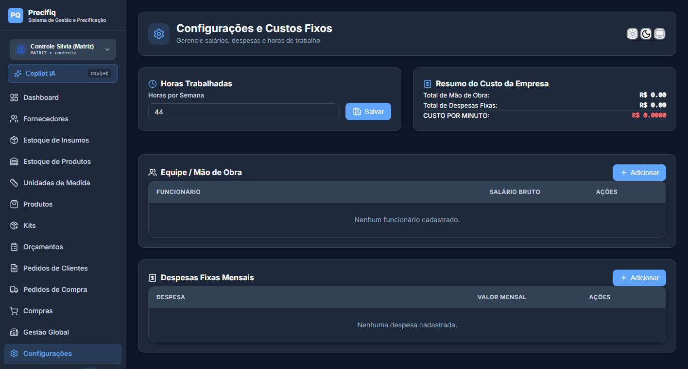
### 2.2 Seletor de empresa

No topo do menu lateral aparece a empresa em que você está trabalhando, com o schema de banco de dados em uso (por exemplo, `MATRIZ • controle`) e uma etiqueta de ambiente:

- **PROD** — base de produção. Tudo que for lançado aqui é dado real.
- **DEMO** — base de demonstração, indicada para treinamento e testes.

Clique na caixa para abrir a lista **Organização & Unidades** e trocar de matriz, filial ou acessar o **Console Superadmin (DcSys)**, quando seu perfil permitir.

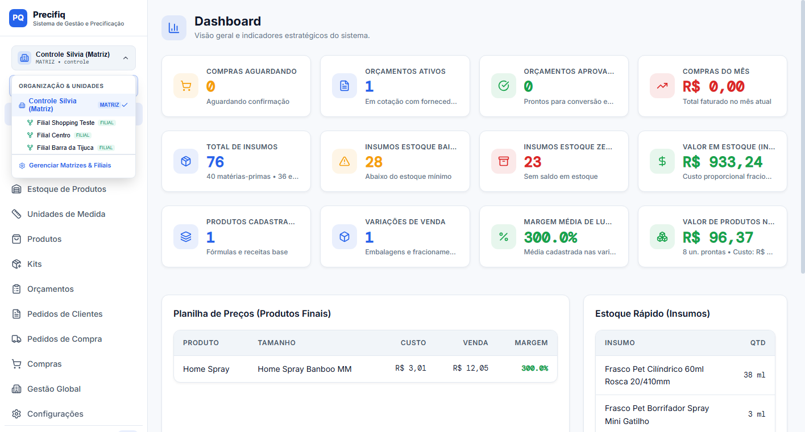

> **Atenção:** confira a etiqueta de ambiente antes de qualquer lançamento. Cada empresa tem base isolada, portanto um cadastro feito na empresa errada não aparece na outra e precisa ser refeito.

### 2.3 Grupos do menu

- **PRINCIPAL** — Dashboard e, para a equipe técnica, o painel Superadmin DcSys.
- **PRODUTOS & OPERAÇÃO** — Pedido de clientes, Produtos, Kits, Estoque de produtos.
- **SUPRIMENTOS & COMPRAS** — Estoque de Insumos, Pedidos de Compra e os demais itens da cadeia de compras (role a barra do menu para ver todos).
- Ao final do menu ficam os itens de apoio, como Unidades de Medida e Configurações.

### 2.4 Rodapé do menu

Mostra o usuário logado e traz dois botões: **alterar senha** (ícone de chave) e **sair do sistema** (ícone de saída). Abaixo aparecem a versão do sistema e os três botões de tema: **claro**, **escuro** e **automático** (segue o tema do sistema operacional).

### 2.5 Atalhos e recursos comuns a todas as telas

- `Ctrl + K` abre o **Copilot IA** de qualquer lugar do sistema.
- O **campo de busca** no cabeçalho filtra a listagem enquanto você digita, sem precisar apertar Enter.
- Os **cabeçalhos de coluna com setas (↑↓)** permitem ordenar a tabela; clique novamente para inverter a ordem.
- A coluna **Ações** traz sempre os botões de **editar** (lápis) e **excluir** (lixeira).
- Telas vazias exibem uma mensagem orientando o próximo passo e, em muitos casos, um botão de atalho para a tela correta.

---

## 3. Ordem recomendada de configuração

Os módulos dependem uns dos outros. Em uma empresa nova, siga esta sequência para não travar no meio do caminho:

| Etapa | Módulo | Por que agora |
|---|---|---|
| 1 | Gestão Global | Criar matriz, filiais e usuários |
| 2 | Perfis de Acesso (RBAC) | Definir o que cada usuário pode fazer |
| 3 | Configurações e Custos Fixos | Sem horas, salários e despesas, o custo por minuto fica R$ 0,00 |
| 4 | Unidades de Medida | Insumos e produtos precisam de unidade para serem cadastrados |
| 5 | Fornecedores | Pré-requisito de orçamentos e compras |
| 6 | Estoque de Insumos | Base de cálculo do custo dos produtos |
| 7 | Produtos Finais | Ficha técnica e formulação |
| 8 | Kits | Agrupamento de produtos já cadastrados |
| 9 | Pedido de Clientes | Operação diária de venda |

---

## 4. Dashboard

Visão geral e indicadores estratégicos do sistema. É a tela inicial e serve para responder, em poucos segundos, "como está a operação hoje".

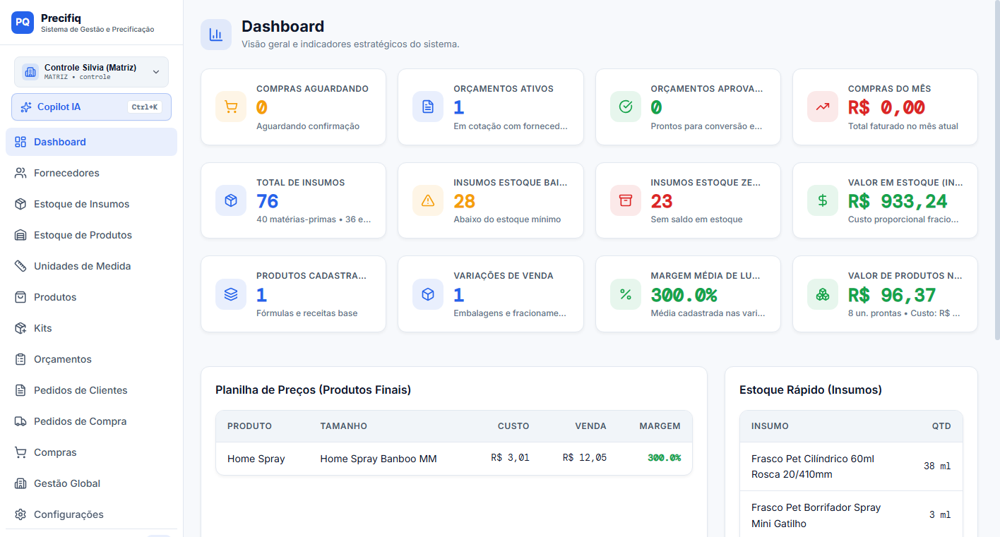

### 4.1 Desempenho comercial & pedidos de clientes

- **Vendas realizadas (mês)** — faturamento dos pedidos faturados e entregues no mês.
- **Lucro bruto realizado** — resultado das vendas, com o percentual de margem sobre vendas.
- **Pendentes de pagamento** — valor a receber e quantidade de pedidos.
- **Pendentes de entrega** — pedidos a expedir e o valor correspondente.

Abaixo dos indicadores, dois painéis detalham os pedidos **pendentes de pagamento** e **aguardando entrega**, com botão **Ver Pedidos** que leva direto à lista filtrada. Quando não há pendências, o painel exibe a confirmação de que tudo está em ordem.

### 4.2 Eficiência operacional & giro de estoque

Traz o **giro de estoque** e o alerta de **insumos com validade crítica**, úteis para antecipar perdas e reposições. Role a página para ver os blocos completos.

> **Dica:** se os indicadores aparecem zerados em uma empresa que já opera, verifique se você está na empresa/filial correta no seletor do topo.

---

## 5. Gestão Global & Governança Corporativa

Módulo de arquitetura multiempresas: hierarquia de matrizes e filiais, com base isolada por unidade, e catálogo unificado de acessos.

No topo há o **Console Técnico de Infraestrutura • DcSys**, de uso exclusivo da equipe técnica, responsável por manutenção preventiva, diagnóstico de integridade dos schemas e provisionamento automatizado de bancos PostgreSQL para cada empresa cadastrada.

Os quatro indicadores mostram: **matrizes** cadastradas, **filiais ativas**, **usuários centrais** e a **base ativa no navegador** (nome da empresa e schema em uso). O botão **Sincronizar**, no canto superior direito, atualiza esses dados.

O módulo tem três abas.

### 5.1 Estrutura Corporativa (Matriz & Filiais)

Exibe a **árvore de empresas e bases de dados**. Cada empresa ou filial possui isolamento total, com schema próprio no PostgreSQL.

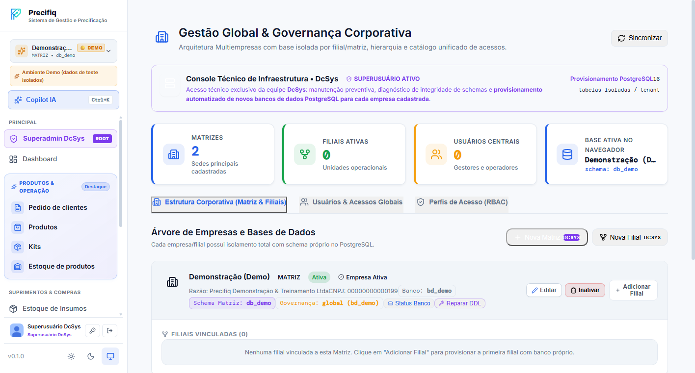

Cada cartão de matriz mostra razão social, CNPJ, banco de dados, schema, modelo de governança e situação (Ativa/Inativa), além das filiais vinculadas. Ações disponíveis:

- **Editar** — altera os dados cadastrais da empresa.
- **Inativar** — suspende o acesso à empresa sem excluir os dados.
- **Adicionar Filial** — abre o formulário de provisionamento.
- **Status Banco** e **Reparar DDL** — verificações técnicas da estrutura do banco.
- **Nova Matriz** e **Nova Filial** — criação de unidades (restrito ao perfil DcSys).

**Como provisionar uma nova filial**

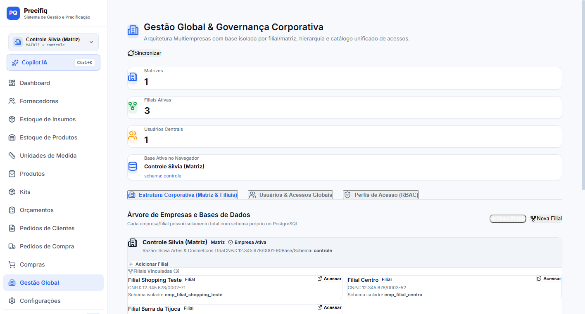

1. Clique em **Adicionar Filial** no cartão da matriz, ou em **Nova Filial** no topo da lista.
2. Confirme a **Matriz Controladora**. A filial é criada no banco da matriz, sob um schema dedicado; a governança corporativa e a autenticação global continuam centralizadas no schema `global` desse banco.
3. Informe o **Nome Fantasia da Filial** (obrigatório), a **Razão Social** e o **CNPJ da Filial**.
4. O campo **Schema da Filial (PostgreSQL)** é preenchido automaticamente segundo a convenção `db_<nome>` e não deve ser alterado.
5. Opcionalmente, cadastre o **Administrador Inicial da Filial**: nome, e-mail de acesso e senha temporária. É o usuário que o cliente usará no primeiro login da unidade.
6. Clique em **Provisionar Banco e Filial**.

> A criação de filial provisiona estrutura de banco. Revise os dados antes de confirmar, porque a exclusão posterior não é uma operação trivial.

### 5.2 Usuários & Acessos Globais

Controle centralizado de usuários e permissões. Cada usuário pode ter acessos específicos a uma ou múltiplas filiais, com perfis diferentes em cada uma.

A tabela lista **colaborador/e-mail**, **tipo global** e **empresas & perfis liberados**. Use a busca para localizar um colaborador e o botão **Novo Usuário** para cadastrar.

Ao criar um usuário, defina: nome, e-mail de acesso, senha inicial, as empresas/filiais liberadas e o perfil em cada uma.

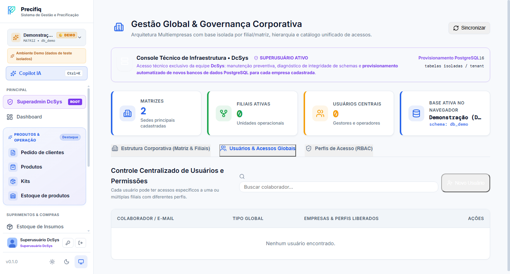

> **Boa prática:** conceda sempre o menor perfil que permita à pessoa fazer o trabalho dela. Ampliar o acesso depois é simples; corrigir um lançamento indevido, não.

### 5.3 Perfis de Acesso (RBAC)

Matriz de perfis e permissões — os papéis e níveis de autorização da governança do sistema.


| Perfil | Alcance |
|---|---|
| **Superusuário (DcSys)** | Acesso técnico e de infraestrutura, exclusivo da equipe DcSys: manutenção, provisionamento e suporte à plataforma |
| **Administrador (Global da Empresa)** | Acesso irrestrito a todas as matrizes, filiais, usuários e configurações globais. É o responsável pelas configurações e parametrizações para a empresa começar a operar |
| **Administrador da Matriz** | Gestão completa da matriz e supervisão de todas as filiais vinculadas a ela |
| **Gerente de Filial** | Gestão operacional, financeira e de estoque restrita à sua filial |
| **Operador Padrão** | Lançamento de pedidos, produtos, insumos e orçamentos na sua unidade |

Abaixo da hierarquia, cartões detalham as permissões de cada perfil. Essa aba é de consulta: use-a para decidir qual perfil atribuir na aba **Usuários & Acessos Globais**.

---

## 6. Configurações e Custos Fixos

Tela onde se gerenciam salários, despesas e horas de trabalho. **É a base de toda a precificação** — enquanto ela não estiver preenchida, o custo por minuto será R$ 0,0000 e os produtos serão precificados apenas pelo custo dos insumos.

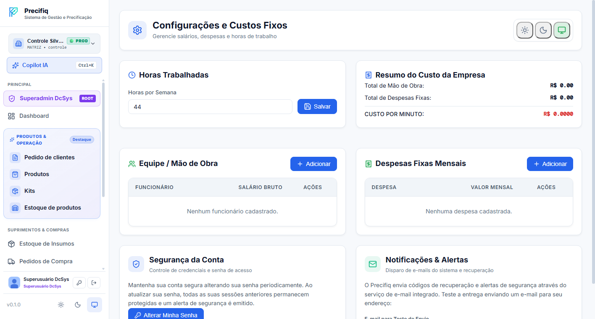

### 6.1 Horas Trabalhadas

Informe as **horas por semana** da operação (o padrão sugerido é 44) e clique em **Salvar**. Esse número é o divisor do cálculo do custo por minuto.

### 6.2 Equipe / Mão de Obra

Clique em **Adicionar** para cadastrar cada funcionário com o **salário bruto**. Use o lápis para corrigir e a lixeira para remover. O somatório alimenta o **Total de Mão de Obra**.

### 6.3 Despesas Fixas Mensais

Clique em **Adicionar** para lançar cada despesa recorrente (aluguel, energia, internet, contabilidade, software) com o **valor mensal**. O somatório alimenta o **Total de Despesas Fixas**.

### 6.4 Resumo do Custo da Empresa

Consolida automaticamente:

- **Total de Mão de Obra**
- **Total de Despesas Fixas**
- **CUSTO POR MINUTO** — valor destacado, aplicado ao tempo de produção de cada produto para compor o custo final.

### 6.5 Segurança da Conta

Permite alterar a senha de acesso pelo botão **Alterar Minha Senha**. Ao atualizar a senha, todas as sessões anteriores permanecem protegidas e um alerta de segurança é emitido. Troque a senha periodicamente.

### 6.6 Notificações & Alertas

O Precifiq envia códigos de recuperação e alertas de segurança pelo serviço de e-mail integrado. Use o campo **E-mail para Teste de Envio** para confirmar que a entrega está funcionando antes de depender dela em produção.

No canto superior direito da tela também estão os três botões de tema (claro, escuro e automático).

> **Revise esta tela sempre que** houver contratação, desligamento, reajuste salarial ou mudança em despesas fixas. Custo desatualizado aqui significa preço de venda errado em todo o catálogo.

---

## 7. Unidades de Medida

Cadastro das unidades usadas em insumos e produtos (L, kg, g, ml e outras). A tela lista **Nome**, **Sigla** e as ações de editar e excluir, com busca no topo.

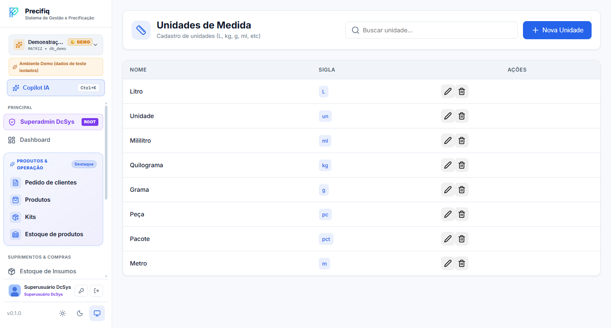

O sistema já vem com um conjunto padrão: Unidade (un), Quilograma (kg), Grama (g), Litro (l), Mililitro (ml), Metro (m), Centímetro (cm), Caixa (cx) e Pacote (pc).

Para incluir outra, clique em **Nova Unidade**, informe nome e sigla e salve.

> **Cuidado ao excluir:** unidades já vinculadas a insumos ou produtos não devem ser removidas, sob risco de inconsistência nos cadastros existentes. Prefira editar o nome a apagar e recriar.

---

## 8. Fornecedores

Cadastro, busca e controle de fornecedores. A listagem mostra **ID**, **Razão Social**, **Nome Fantasia**, **CNPJ/CPF**, **UF**, **Contato** e **Ações**. A busca no topo aceita razão social, nome ou CNPJ.

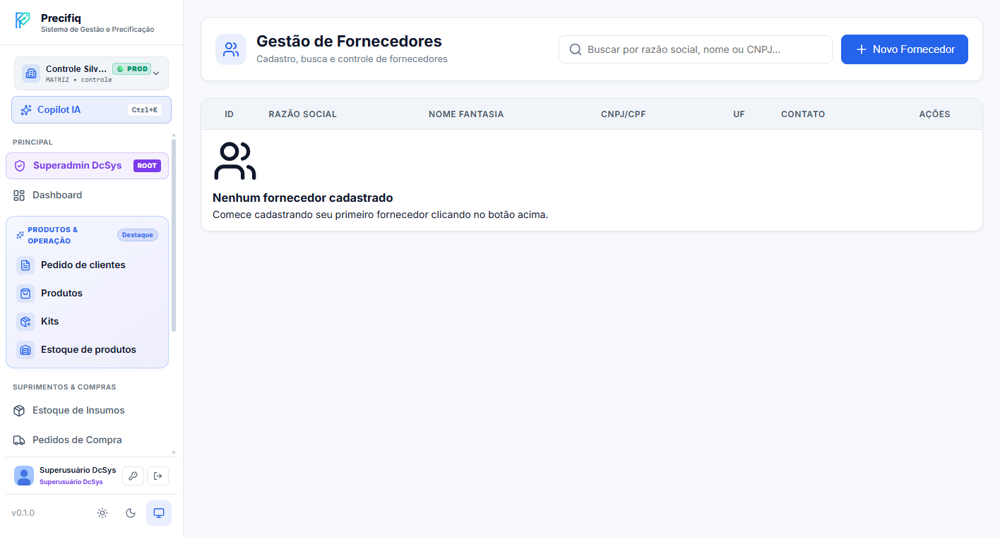

### 8.1 Cadastrar um fornecedor

Clique em **+ Novo Fornecedor** e preencha o formulário:

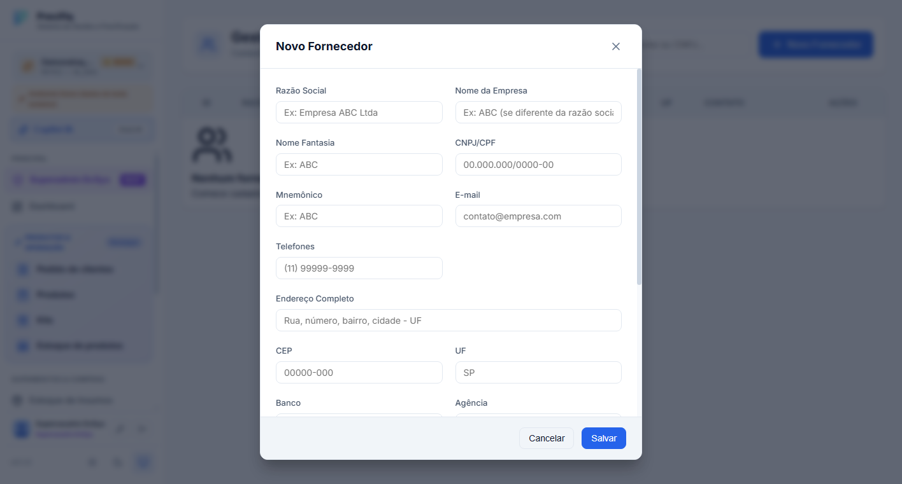

**Identificação**
- **Razão Social** — nome jurídico completo.
- **Nome da Empresa** — preencha apenas se for diferente da razão social.
- **Nome Fantasia**
- **CNPJ/CPF** — formato `00.000.000/0000-00`; aceita também CPF, para fornecedores pessoa física.
- **Mnemônico** — apelido curto usado para localizar o fornecedor rapidamente nas telas de orçamento e compra.

**Contato**
- **E-mail**
- **Telefones** — formato `(11) 99999-9999`.

**Endereço**
- **Endereço Completo** — rua, número, bairro, cidade e UF.
- **CEP** e **UF**.

**Dados bancários**
- **Banco**, **Agência** e os demais campos de conta. Role o formulário até o fim para completá-los.

Clique em **Salvar** para gravar ou **Cancelar** para descartar.

> Preencher o **mnemônico** e os **dados bancários** desde o cadastro economiza tempo depois, na emissão de pedidos de compra e na conferência de pagamentos.

---

## 9. Estoque de Insumos

Gestão de saldos físicos, matérias-primas, embalagens e custos. É a tela mais importante da cadeia de suprimentos, porque o custo dos produtos nasce daqui.

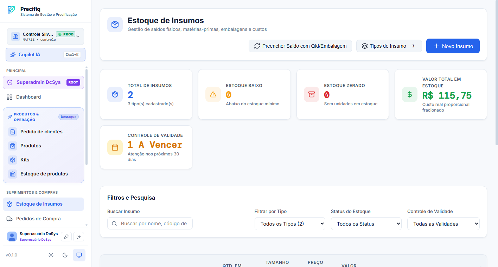

### 9.1 Indicadores

- **Total de Insumos** — quantidade de insumos e de tipos cadastrados.
- **Estoque Baixo** — itens abaixo do estoque mínimo definido.
- **Estoque Zerado** — itens sem unidades disponíveis.
- **Valor Total em Estoque** — custo real proporcional fracionado, ou seja, o valor considerando o consumo parcial das embalagens.
- **Controle de Validade** — itens a vencer nos próximos 30 dias.

### 9.2 Ações do cabeçalho

- **+ Novo Insumo** — cadastra um insumo.
- **Tipos de Insumo** — gerencia as categorias (o número ao lado indica quantas existem). Sirva-se delas para separar, por exemplo, matéria-prima, embalagem e rotulagem.
- **Preencher Saldo com Qtd/Embalagem** — recalcula o saldo dos insumos a partir da quantidade de embalagens e do tamanho de cada uma. Use quando os saldos foram importados ou lançados de forma incompleta.

### 9.3 Filtros e pesquisa

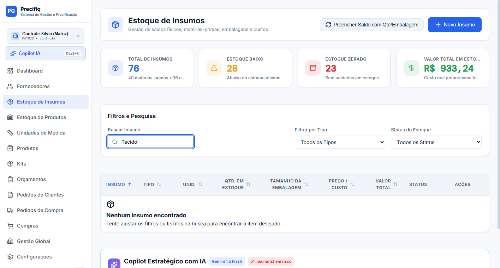

- **Buscar Insumo** — por nome ou código.
- **Filtrar por Tipo** — restringe a uma categoria.
- **Status do Estoque** — todos, baixo ou zerado.
- **Controle de Validade** — todas as validades, a vencer ou vencidas.

### 9.4 A tabela de insumos

As colunas são ordenáveis e trazem: **Insumo**, **Tipo**, **Unidade**, **Qtd. em estoque**, **Tamanho da embalagem**, **Preço**, **Valor**, **Validade**, **Status** e **Ações**.

A lógica de custo é a seguinte: você informa o preço pago pela embalagem inteira e o tamanho dela; o sistema calcula o custo unitário fracionado e o aplica automaticamente nas fichas técnicas dos produtos.

**Exemplo:** um frasco de essência de 1.000 ml comprado a R$ 50,00 gera um custo de R$ 0,05 por ml. Se a ficha técnica de um produto consome 30 ml, o custo desse insumo no produto é R$ 1,50.

> Mantenha o **estoque mínimo** preenchido em todos os insumos: é ele que faz o indicador de **Estoque Baixo** e os alertas do Dashboard funcionarem.

---

## 10. Produtos Finais

Fichas técnicas, formulações e custos de produtos acabados. A listagem mostra **ID**, **Nome do Produto**, **Rendimento Base**, **Descrição** e **Ações**, com busca por nome.

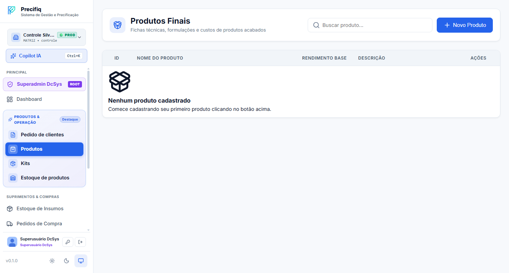

### 10.1 Cadastrar um produto

Clique em **+ Novo Produto** e informe:

1. **Nome e descrição** do produto.
2. **Rendimento base** — quanto uma receita/lote produz. É a referência do cálculo de custo por unidade.
3. **Formulação (ficha técnica)** — os insumos consumidos e a quantidade de cada um. O custo vem automaticamente do Estoque de Insumos.
4. **Tempo de produção** — usado junto com o custo por minuto das Configurações para compor o custo de mão de obra.
5. **Variações e tamanhos** — as versões comercializáveis do produto (por exemplo, 200 ml e 500 ml).
6. **Margem e preço de venda** — o sistema sugere o preço a partir do custo e da margem. Respeite a margem mínima configurada.

### 10.2 Boas práticas

- Cadastre primeiro todos os insumos da receita; sem eles, a formulação fica incompleta e o custo, subestimado.
- Sempre que o preço de um insumo mudar, revise os produtos que o utilizam — o custo é recalculado, mas o preço de venda praticado é uma decisão sua.
- Só é possível controlar estoque de produto acabado depois de cadastrar as **variações**.

---

## 11. Kits de Produtos

Criação, precificação e gestão de pacotes promocionais e kits para venda.

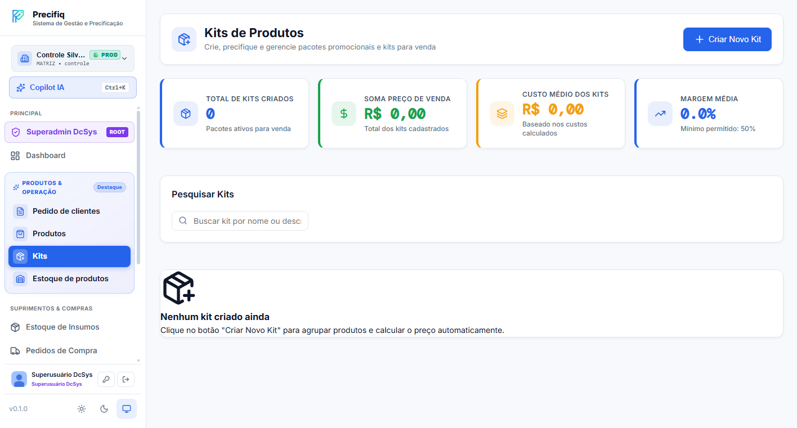

### 11.1 Indicadores

- **Total de Kits Criados** — pacotes ativos para venda.
- **Soma Preço de Venda** — total dos kits cadastrados.
- **Custo Médio dos Kits** — com base nos custos calculados.
- **Margem Média** — com indicação da margem mínima permitida (padrão de 50%).

### 11.2 Criar um kit

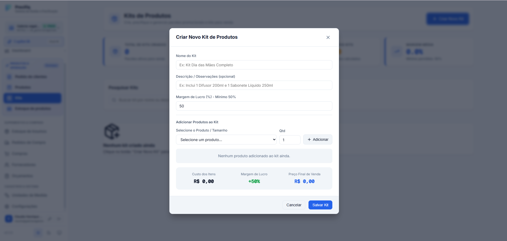

1. Clique em **+ Criar Novo Kit**.
2. Dê nome e descrição ao kit.
3. Selecione os produtos que o compõem e a quantidade de cada um.
4. O sistema soma os custos e **calcula o preço automaticamente**, aplicando a margem.
5. Ajuste o preço final, se for uma ação promocional, observando a margem mínima.
6. Salve.

Use a busca por nome ou descrição para localizar kits já criados.

> Kits só podem ser montados com produtos já cadastrados em **Produtos Finais**. Se a lista aparecer vazia, cadastre os produtos primeiro.

---

## 12. Estoque de Produtos

Controle de saldos físicos de produtos acabados, custos e preços de venda. Diferencia-se do Estoque de Insumos por tratar do que está pronto para vender.

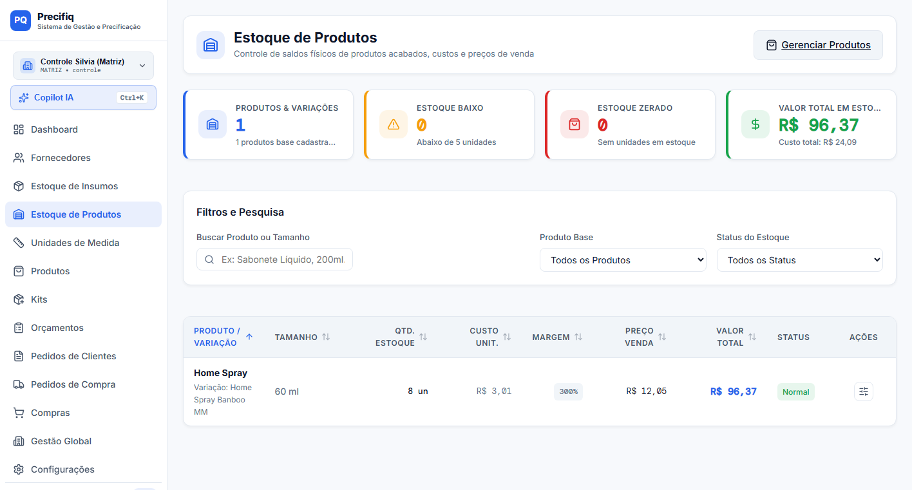

### 12.1 Indicadores

- **Produtos & Variações** — quantidade de produtos base cadastrados.
- **Estoque Baixo** — itens abaixo de 5 unidades.
- **Estoque Zerado** — itens sem unidades em estoque.
- **Valor Total em Estoque** — com o custo total correspondente.

### 12.2 Filtros

- **Buscar Produto ou Tamanho** — por exemplo, "Sabonete Líquido, 200ml".
- **Produto Base** — filtra por produto pai.
- **Status do Estoque** — todos, baixo ou zerado.

### 12.3 Ações

- **Gerenciar Produtos**, no topo, leva ao cadastro de Produtos Finais.
- Quando nenhum produto tem variações cadastradas, a tela exibe o atalho **Ir para Produtos**.

> O estoque é organizado por **variação**, não por produto base. Um produto sem variações cadastradas não aparece nesta tela.

---

## 13. Orçamentos & Compras

Cotações, planejamento e pedidos de aquisições. É o ponto de partida da cadeia de compras. A listagem mostra **ID**, **Título**, **Data de Criação**, **Status** e **Ações**, com busca por orçamento.

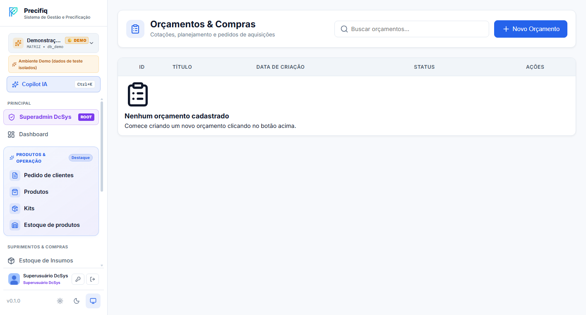

### 13.1 Criar um orçamento

1. Clique em **+ Novo Orçamento**.
2. Dê um **título** que identifique a cotação (por exemplo, "Reposição de embalagens — outubro").
3. Inclua os itens a cotar, com quantidades.
4. Registre os fornecedores consultados e os preços recebidos.
5. Salve. O orçamento passa a acompanhar um **status** ao longo do processo.

### 13.2 Converter em pedido

Ao definir o fornecedor vencedor, **converta o orçamento em pedido de compra**. Essa conversão é a única forma de gerar registros na tela de Pedidos de Compra, preservando o rastro entre cotação, pedido e compra recebida.

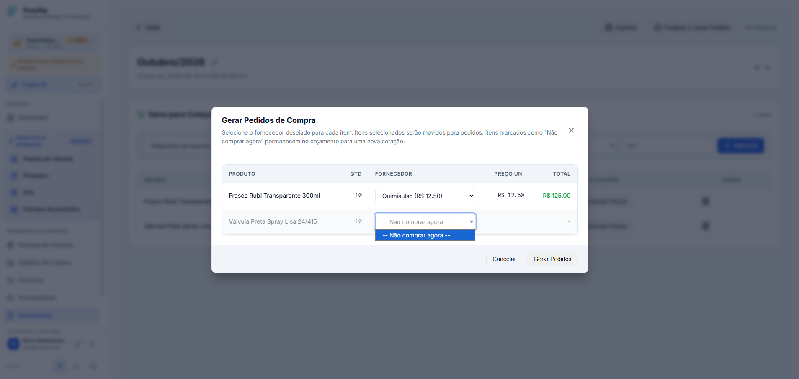
---

## 14. Pedidos de Compra

Gerenciamento dos pedidos gerados a partir de orçamentos convertidos. A tabela mostra **ID**, **Fornecedor**, **Orçamento** de origem, **Data**, **Forma de pagamento**, **Valor Total** e **Ações**. A busca aceita fornecedor, orçamento ou ID do pedido.

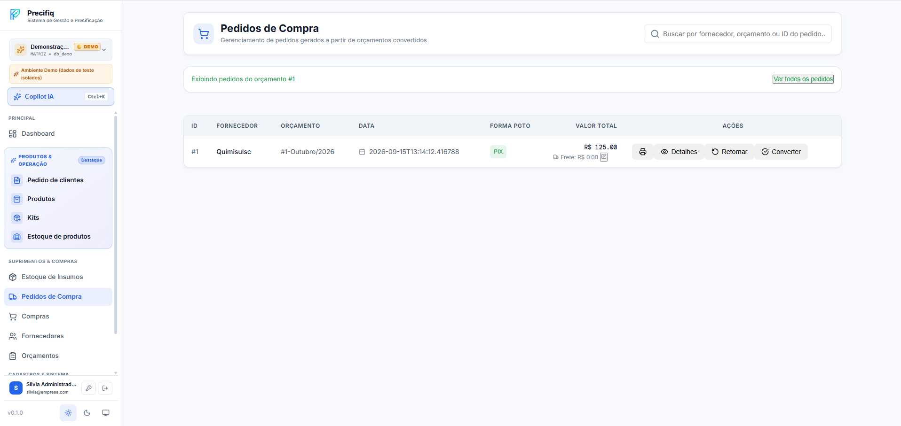

Esta tela não cria pedidos do zero: se estiver vazia, vá a **Orçamentos** e converta uma cotação. Depois de emitido e confirmado o pedido, **converta-o em compra** para registrar o recebimento.

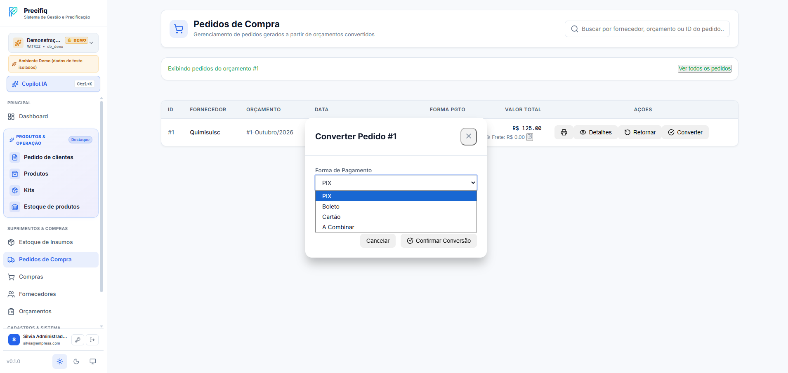

---

## 15. Compras

Gerenciamento de compras recebidas e pendentes. A listagem traz **ID**, **Data de Criação**, **Prazo**, **Status**, **Valor Total** e **Ações**, com busca por ID, prazo ou justificativa.

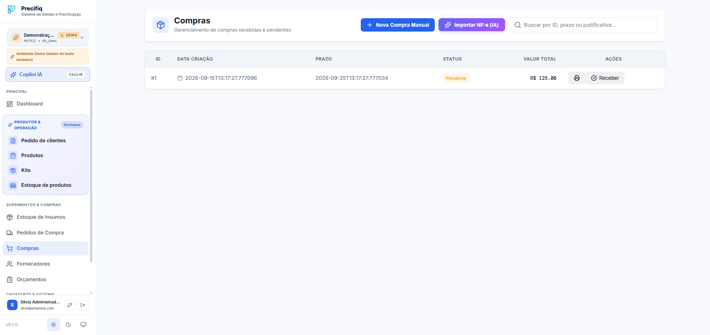


### 15.1 Nova Compra Manual

Clique em **+ Nova Compra Manual** para registrar uma aquisição que não passou pelo fluxo de orçamento — uma compra emergencial, por exemplo. Informe fornecedor, itens, quantidades, valores e prazo.

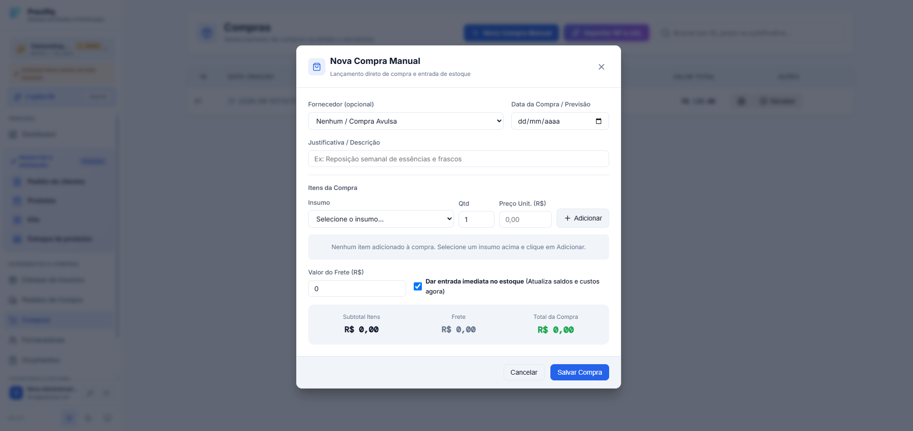

### 15.2 Importar NF-e (IA)

Clique em **Importar NF-e (IA)** e envie o arquivo da nota fiscal eletrônica. O recurso de inteligência artificial lê a nota e preenche automaticamente fornecedor, itens, quantidades e valores.

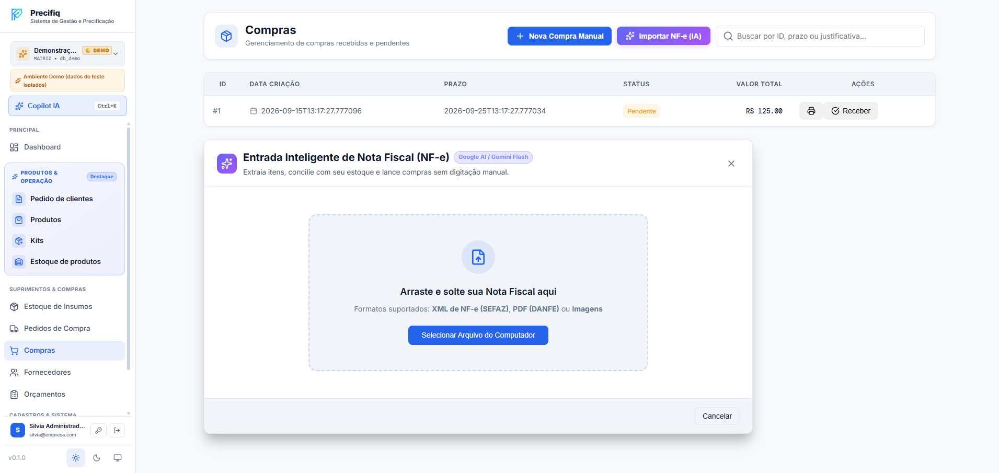

> **Sempre confira o resultado da importação** antes de salvar, com atenção especial a unidades de medida e tamanhos de embalagem. É essa informação que define o custo fracionado dos insumos e, por consequência, o preço dos seus produtos.

### 15.3 Fluxo completo de suprimentos

```
Orçamento  →  Pedido de Compra  →  Compra  →  Estoque de Insumos
(cotação)     (conversão)          (recebimento)   (saldo e custo atualizados)
```

Ao confirmar o recebimento de uma compra, os saldos e os custos do Estoque de Insumos são atualizados, e isso se propaga para o custo dos produtos.
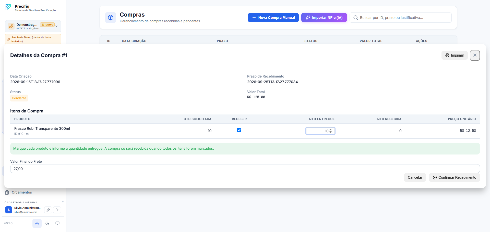
---

## 16. Pedido de Clientes

Gestão operacional de pedidos: gerencia pedidos de clientes e acompanha entregas.

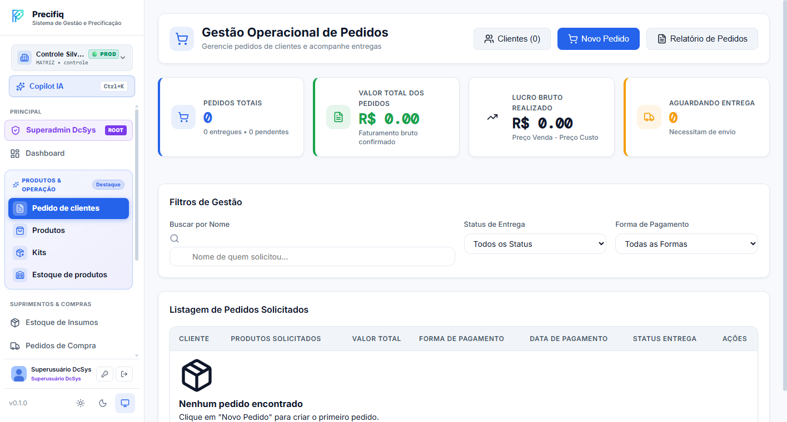

### 16.1 Indicadores

- **Pedidos Totais** — com a divisão entre entregues e pendentes.
- **Valor Total dos Pedidos** — faturamento bruto confirmado.
- **Lucro Bruto Realizado** — preço de venda menos preço de custo.
- **Aguardando Entrega** — pedidos que necessitam de envio.

### 16.2 Ações do cabeçalho

- **Clientes** — abre o cadastro de clientes; o número entre parênteses mostra quantos existem.
- **Novo Pedido** — registra uma venda.
- **Relatório de Pedidos** — gera o relatório da operação comercial.

### 16.3 Filtros de gestão

- **Buscar por Nome** — nome de quem solicitou.
- **Status de Entrega** — todos, pendente ou entregue.
- **Forma de Pagamento** — todas as formas ou uma específica.

### 16.4 Registrar um pedido

1. Clique em **Novo Pedido**.
2. Selecione o **cliente** (cadastre-o antes, em **Clientes**, se necessário).
3. Adicione os **produtos ou kits** solicitados e as quantidades.
4. Defina a **forma de pagamento** e a **data de pagamento**.
5. Informe as condições de entrega e salve.

A **Listagem de Pedidos Solicitados** mostra Cliente, Produtos Solicitados, Valor Total, Forma de Pagamento, Data de Pagamento, Status de Entrega e Ações. Use a coluna Ações para confirmar pagamento, marcar entrega, editar ou excluir o pedido.

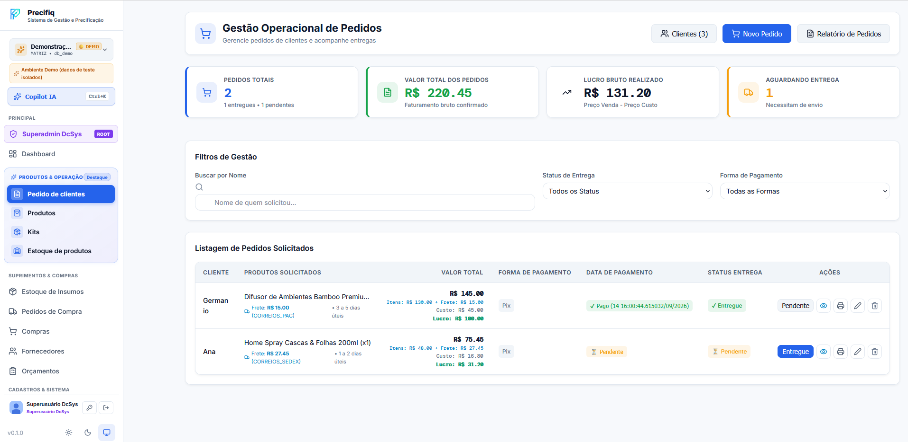

> Atualizar o status de pagamento e de entrega é o que mantém o Dashboard confiável. Pedido faturado sem baixa aparece indevidamente como pendente.

---

## 17. Copilot IA

Assistente operacional e financeiro que permite perguntar, em linguagem natural, sobre estoque, custos, produtos e compras. Abra pelo item **Copilot IA** no menu lateral ou pelo atalho `Ctrl + K`.

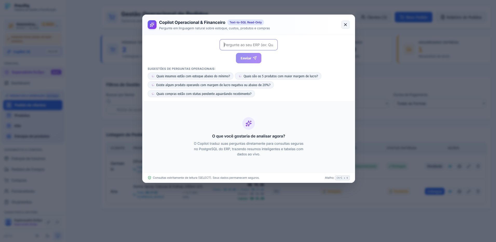

### 17.1 Como funciona

O Copilot traduz suas perguntas em consultas seguras ao PostgreSQL do ERP e devolve resumos inteligentes e tabelas com dados ao vivo. As consultas são **estritamente de leitura (SELECT)** — o Copilot não altera, não apaga e não cria registros.

### 17.2 Como usar

1. Abra o Copilot.
2. Digite a pergunta no campo **Pergunte ao seu ERP** ou clique em uma das sugestões prontas.
3. Clique em **Enviar** e leia o resumo e a tabela de resultados.

### 17.3 Exemplos de perguntas

- Quais insumos estão com estoque abaixo do mínimo?
- Quais são os 5 produtos com maior margem de lucro?
- Existe algum produto operando com margem de lucro negativa ou abaixo de 20%?
- Quais compras estão com status pendente aguardando recebimento?

**Dicas para respostas melhores**

- Seja específico quanto ao período ("no último mês", "em setembro").
- Pergunte uma coisa por vez; perguntas encadeadas tendem a respostas parciais.
- O Copilot responde sobre a **empresa ativa** no seletor. Para consultar outra unidade, troque de empresa antes.
- Para decisões de valor relevante, confira o número na tela do módulo correspondente.

---

## 18. Perguntas frequentes

**Cadastrei tudo, mas o custo do produto está muito abaixo do real. Por quê?**
Provavelmente as Configurações e Custos Fixos estão incompletas. Sem horas por semana, salários e despesas fixas, o custo por minuto fica R$ 0,0000 e o produto é precificado apenas pelos insumos.

**A tela de Pedidos de Compra está vazia e não há botão de criar.**
Ela só recebe pedidos convertidos a partir de orçamentos. Vá a **Orçamentos & Compras**, crie a cotação e converta-a.

**A tela de Compras está vazia.**
Compras nascem da conversão de pedidos de compra. Alternativamente, use **Nova Compra Manual** ou **Importar NF-e (IA)**.

**Cadastrei o produto, mas ele não aparece no Estoque de Produtos.**
O estoque é controlado por variação. Cadastre as variações e tamanhos do produto em **Produtos Finais**.

**Não encontro um cadastro que fiz ontem.**
Verifique a empresa ativa no seletor do topo. Cada matriz e filial tem base isolada, e um cadastro feito em uma unidade não aparece em outra.

**Os saldos de insumos estão inconsistentes após uma importação.**
Use **Preencher Saldo com Qtd/Embalagem**, na tela de Estoque de Insumos, para recalcular a partir da quantidade de embalagens e do tamanho de cada uma.

**Esqueci minha senha.**
O sistema envia códigos de recuperação por e-mail. Se não chegarem, peça ao administrador para testar a entrega em **Configurações → Notificações & Alertas**.

**Como troco a senha?**
Pelo ícone de chave no rodapé do menu lateral, ou pelo botão **Alterar Minha Senha** em Configurações. As sessões anteriores permanecem protegidas e um alerta de segurança é emitido.

**Quero treinar a equipe sem sujar os dados reais.**
Troque para a empresa marcada como **DEMO** no seletor de empresas.

---

## 19. Glossário

| Termo | Significado |
|---|---|
| **Matriz** | Sede principal da empresa, com banco de dados próprio |
| **Filial** | Unidade operacional vinculada a uma matriz, com schema dedicado |
| **Schema** | Área isolada dentro do banco PostgreSQL onde ficam os dados de uma empresa ou filial |
| **RBAC** | Controle de acesso baseado em papéis (perfis de permissão) |
| **DcSys** | Equipe técnica responsável pela infraestrutura e pelo suporte à plataforma |
| **Insumo** | Matéria-prima, embalagem ou material consumido na produção |
| **Produto final** | Item acabado, com ficha técnica e pronto para venda |
| **Variação** | Versão comercializável de um produto (tamanho, volume, apresentação) |
| **Kit** | Pacote que agrupa produtos com preço próprio |
| **Ficha técnica / formulação** | Lista de insumos e quantidades que compõem um produto |
| **Rendimento base** | Quantidade produzida por receita ou lote |
| **Custo fracionado** | Custo unitário obtido dividindo o preço da embalagem pelo seu tamanho |
| **Custo por minuto** | Mão de obra e despesas fixas rateadas por minuto de produção |
| **Margem** | Diferença percentual entre preço de venda e custo |
| **Orçamento** | Cotação de compra junto a fornecedores |
| **Pedido de compra** | Pedido formal ao fornecedor, gerado a partir de um orçamento |
| **Compra** | Registro do recebimento da mercadoria, que atualiza o estoque |
| **NF-e** | Nota fiscal eletrônica, importável com leitura por IA |
| **Text-to-SQL** | Tradução de pergunta em linguagem natural para consulta ao banco |
