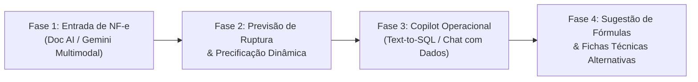

# 🚀 Roadmap de Inteligência Artificial: Sistema Controle (Silvia)

Este documento estabelece o plano diretor e arquitetura para a integração do ecossistema de IA do Google (**Gemini API** e **Google Cloud AI**) no sistema ERP **Controle**.

---

## 🗺️ Visão Geral das Fases

---

## 📌 Detalhamento das Fases

### 📄 Fase 1: Automação de Entrada de Notas Fiscais (Document AI & Gemini)
* **Objetivo:** Eliminar a digitação manual de compras e atualização de estoque a partir de notas fiscais de fornecedores.
* **Tecnologias:**
  - **Google Cloud Document AI (Invoice Parser)** ou **Gemini 1.5 Flash Multimodal** para extração direta de PDF/Imagem/XML.
  - **Gemini 1.5 Flash** para *Fuzzy Match & Semantic Reconciliation* entre descrições da nota e insumos cadastrados no banco.
* **Entregáveis:**
  1. **Backend (Kotlin/Ktor):**
     - Endpoint `POST /api/ai/nfe/extrair` (Upload multipart de PDF/XML -> Extração estruturada de cabeçalho e itens).
     - Endpoint `POST /api/ai/nfe/confirmar-entrada` (Gravação automática em Compras, Itens de Compra, atualização de Custo Médio e Saldo de Insumos).
     - Serviço de conciliação automática com histórico de sinônimos/códigos de fornecedor.
  2. **Frontend (React + TypeScript):**
     - Modal de Upload de NF-e com Drag-and-Drop na tela de Compras (`ComprasPage.tsx`).
     - Painel de Conferência visual lado a lado: Dados extraídos vs Insumos correspondentes com seletor de override e indicador de confiança (badge %).
* **Impacto:** Redução de 95% no tempo de lançamento de notas fiscais e erradicação de erros de digitação em custos e quantidades.

---

### 📈 Fase 2: Previsão Preditiva de Ruptura de Estoque e Assistente de Margem — ✅ Concluída
* **Objetivo:** Transformar a gestão de estoque de reativa em preditiva e proteger a margem de lucro contra flutuações de custos de insumos.
* **Tecnologias:**
  - **Gemini 1.5 Flash:** Análise de séries temporais de consumo, sazonalidade e impacto de custos.
* **Entregáveis Implementados:**
  1. **Motor de Previsão de Demanda & Ruptura (`PrevisaoService.kt`):**
     - Cruzamento de consumo real diário auditado (`movimento_estoque_insumo` com `SAIDA_PRODUCAO`), estoque atual e `estoque_minimo`.
     - Estimativa matemática de "Dias até Ruptura", classificação de risco (`CRITICO`, `ALERTA`, `NORMAL`) e cálculo da quantidade sugerida de compra.
  2. **Assistente de Precificação & Margem:**
     - Identificação em tempo real de variações com margem comprimida (< 30%) ou em prejuízo (preço de venda < custo unitário).
     - Sugestão inteligente do preço recomendado para recuperação da rentabilidade de meta.
  3. **Ação Direta de Compras (1-Click Replenishment):**
     - Rota `POST /api/ai/previsao/gerar-orcamento`: gera automaticamente um orçamento em elaboração (`orcamentos_compra` com `EM_DIGITACAO`) contendo os insumos críticos.
  4. **Frontend Dashboard (`DashboardPage.tsx`):**
     - Card de *Copilot Estratégico com IA* com resumo executivo em linguagem natural gerado pelo Gemini, abas de Ruptura e Margem, badges de urgência e botão de ação direta.
* **Impacto:** Zero paradas de produção por falta de matéria-prima e manutenção contínua da rentabilidade dos produtos.

---

### 💬 Fase 3: Copilot Operacional e Financeiro (Chat com Dados) — ✅ Concluída
* **Objetivo:** Permitir que o gestor faça perguntas em linguagem natural sobre o negócio e obtenha respostas imediatas com dados reais.
* **Tecnologias:**
  - **Gemini 1.5 Flash:** Text-to-SQL seguro com isolamento de transação *Read-Only*.
* **Entregáveis Implementados:**
  1. **Validador de Segurança em Profundidade (`SqlSecurityValidator.kt`):**
     - Garantia estrita de comandos `SELECT` / `WITH ... SELECT`.
     - Bloqueio rígido de comandos mutativos (`DROP`, `DELETE`, `INSERT`, `UPDATE`, `ALTER`, `TRUNCATE`, etc.), comentários maliciosos e múltiplos comandos encadeados.
     - Whitelist estrita de tabelas operacionais do ERP e injeção mandatória de `LIMIT 50`.
  2. **Pipeline de Execução Segura (`CopilotService.kt`):**
     - Execução JDBC com `connection.isReadOnly = true` e timeout rígido de 5 segundos.
     - Síntese executiva e formatação amigável das respostas via `GeminiService.kt`.
     - Endpoints REST: `POST /api/ai/copilot/perguntar` e `GET /api/ai/copilot/sugestoes`.
  3. **Frontend Spotlight Copilot (`CopilotModal.tsx` & `Sidebar.tsx`):**
     - Modal universal acessível globalmente via atalho **`Ctrl + K`** (ou **`Cmd + K`**) e botão fixo na barra lateral.
     - Campo de busca instantânea com sugestões de perguntas pré-configuradas.
     - Renderização de respostas em Markdown, tabelas dinâmicas interativas e bloco colapsável para auditoria do SQL executado com botão de cópia.
* **Impacto:** Eliminação da necessidade de exportar relatórios complexos para tomar decisões do dia a dia.

---

### 🧪 Fase 4: Sugestão Dinâmica de Fichas Técnicas & Formulações Alternativas — ✅ Concluída
* **Objetivo:** Evitar paralisações em Ordens de Produção (OP) quando houver indisponibilidade pontual de um insumo específico.
* **Tecnologias:**
  - **Gemini 1.5 Flash:** Raciocínio químico/aromático, análise de famílias funcionais e cálculo proporcional de formulações cosméticas.
* **Entregáveis Implementados:**
  1. **Motor de Formulação Alternativa (`FormulacaoIaService.kt` & `GeminiService.kt`):**
     - Mapeamento inteligente de grupos funcionais e famílias aromáticas (veículos/solventes, essências com perfis olfativos afins, frascos e tampas).
     - Determinação de equivalência técnica (`fatorEquivalencia`), cálculo da quantidade adaptada e atribuição de score de compatibilidade (%).
     - Parecer técnico estruturado com justificativa do químico formulador.
  2. **Execução de OP Adaptada com Auditoria Transacional:**
     - Endpoint `POST /api/ai/formulacao/produzir-com-substitutos` com baixa atômica de insumos (`FOR UPDATE`).
     - Registro explícito no ledger (`movimento_estoque_insumo`) rastreando o insumo original e o insumo substituto adotado, garantindo rastreabilidade sanitária.
     - Preservação estrita da Ficha Técnica Master original cadastrada em `receita_insumo`.
  3. **Interface Integrada na Ordem de Produção (`ProdutosFinaisPage.tsx`):**
     - Detecção automática de déficit no modal de conversão com banner inteligente de assistência da IA.
     - Painel comparativo de sugestões com seletor/checkbox de aprovação, score (%) e justificativa técnica.
     - Botão *"Confirmar Produção com Substitutos Aprovados"*.
* **Impacto:** Continuidade ininterrupta da produção artesanal mesmo durante oscilações na cadeia de suprimentos.

---

## 🛡️ Diretrizes de Segurança, LGPD e FinOps

1. **Proteção de Dados (LGPD):** Nenhum dado pessoal identificável (CPF, endereço, telefone, dados bancários de clientes) é enviado para modelos de linguagem. O backend realiza a sanitização prévia.
2. **FinOps (Gestão de Custos de IA):**
   - Utilização do modelo **`gemini-1.5-flash`** para 90% das requisições (custo ínfimo por mil tokens e resposta em submilisegundos).
   - Cache de previsões e análises no banco de dados para evitar reprocessamentos desnecessários.
